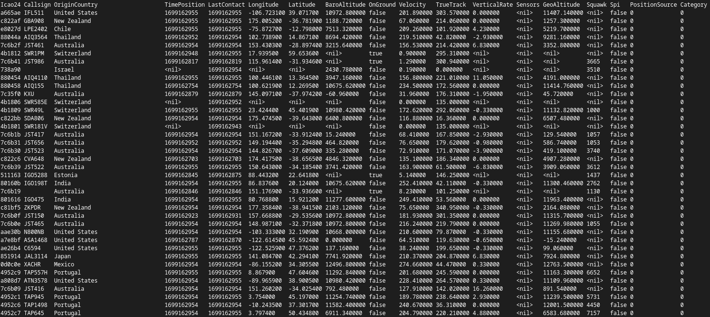

# gopensky (golang opensky network api)
[](https://pkg.go.dev/github.com/navidys/gopensky)
[](https://goreportcard.com/report/github.com/navidys/gopensky)

This is the golang implementation of the OpenSky network's live API.
The API lets you retrieve live airspace information (ADS-B and Mode S data) for research and non-commerical purposes.

For documentation and examples visit [Golang OpenSky Network API](https://navidys.github.io/gopensky/).

A `gopensky-query` binary command line is also available to query the opensky network api.

`NOTE:` there are some limitation sets for anonymous and OpenSky users, visit following links for more information:
* [OpenSky Network Rest API documentation](https://openskynetwork.github.io/opensky-api/)
* [OpenSky Network Website](https://opensky-network.org/).

## gopensky module

```
import (
	"context"
	"fmt"
	"os"

	"github.com/navidys/gopensky"
)

func main() {
	conn, err := gopensky.NewConnection(context.Background(), "username", "password")
	if err != nil {
		fmt.Println(err)
		os.Exit(1)
	}

	// retrieve all states information
	statesData, err := gopensky.GetStates(conn, 0, nil, nil)
	if err != nil {
		fmt.Println(err)
		os.Exit(2)
	}

	for _, state := range statesData.States {
		fmt.Printf("ICAO24: %s, Origin Country: %s, Longitude: %v, Latitude: %v \n", state.Icao24, state.OriginCountry, state.Longitude, state.Latitude)
	}
}
```

## gopensky-query cmd

### build

```
$ make binary
```

### json output

```
$ ./bin/gopensky-query /bin/gopensky-query states -j
{
    "time": 1699160183,
    "states": [
        {
            "icao24": "c067ae",
            "callsign": "ACA327  ",
            "origin_country": "Canada",
            "time_position": 1699160183,
            "last_contact": 1699160188,
            "longitude": -114.0126,
            "latitude": 51.1315,
            "baro_altitude": null,
            "on_ground": true,
            "velocity": 0,
            "true_track": 67.5,
            "vertical_rate": null,
            "sensors": null,
            "geo_altitude": null,
            "squawk": null,
            "spi": false,
            "position_source": 0,
            "category": 0
        },
        {
            ....
        }
    ]
}
```

### table output
```
$  ./bin/gopensky-query /bin/gopensky-query states
```


